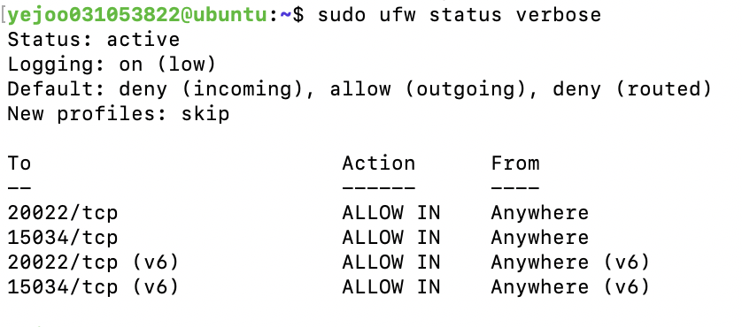

# 요구사항 수행 내역서

## 1. 수행 내역 기록
### 1. SSH 포트 변경(20022) 및 Root 원격 접속 차단 설정
#### (1) 포트 변경 및 Root 원격 접속 차단
SSH 서버의 설정값들이 들어있는 파일에서 설정 변경
```
sudo vim /etc/ssh/sshd_config
```

20022로 포트 변경
```
#Port 22 -> Port 20022
```

Root 접속 차단
```
#PermitRootLogin prohibit-password -> PermitRootLogin no
```

변경 사항 적용: 설정 적용을 위해 ssh 서비스를 재시작 해야한다.
```
sudo systemctl restart ssh
```

#### (2) 수행 내역
**SSH 포트 변경 확인 내역**
- **확인 방법**: `ss-tulnp` 명령어를 통한 포트 리슨 상태 점검
- **증거 지표**
  - 기본 22번 포트가 아닌 문제 요구사항에 지정된 포트 **20022**가 활성화됨
  - 상태가 **LISTEN**으로 표시되어 외부 접속 수신이 가능함을 확인
- **결과 데이터**
  ```text
  yejoo031053822@ubuntu:~$ sudo ss -tulnp | grep sshd
  tcp   LISTEN 0      128                0.0.0.0:20022      0.0.0.0:*    users:(("sshd",pid=3490,fd=3))           
  tcp   LISTEN 0      128                   [::]:20022         [::]:*    users:(("sshd",pid=3490,fd=4)) 
  ```

**Root 원격 접속 차단 설정 내역**
- **확인 방법**: `grep PermitRootLogin /etc/ssh/sshd_config` 명령어를 통해 SSH 설정 파일을 열어 PermitRootLogin 항목을 확인
- **결과 데이터**
  ```text
  yejoo031053822@ubuntu:~$ grep PermitRootLogin /etc/ssh/sshd_config
  PermitRootLogin no
  ```

### 2. 방화벽 활성화 및 20022/tcp, 15034/tcp만 허용
#### (1) 방화벽 설정
기본 정책 설정: 모든 들어오는 신호는 일단 막고, 나가는 신호는 허용하는 기본 정책 설정
```
sudo ufw default deny incoming
sudo ufw default allow outgoing
```

과제에서 요구한 필수 포트 허용
```
sudo ufw allow 20022/tcp
sudo usw allow 15034/tcp
```

방화벽 활성화: 설정한 규칙을 시스템에 실제로 적용한다.
```
sudo ufw enable
```

#### (2) 수행 내역
**방화벽 설정 확인**
- **확인 방법**: `sudo ufw status verbose` 명령어를 통해 방화벽 상태를 확인
- **결과 데이터**
  ```text
  yejoo031053822@ubuntu:~$ sudo ufw status verbose
  Status: active
  Logging: on (low)
  Default: deny (incoming), allow (outgoing), deny (routed)
  New profiles: skip
  
  To                         Action      From
  --                         ------      ----
  20022/tcp                  ALLOW IN    Anywhere                  
  15034/tcp                  ALLOW IN    Anywhere                  
  20022/tcp (v6)             ALLOW IN    Anywhere (v6)             
  15034/tcp (v6)             ALLOW IN    Anywhere (v6)             
  ```

## 2. 필수 증거 자료 체크리스트
- [x] SSH 포트 변경(20022) 및 Root 원격 접속 차단 설정 확인 내역
- [x] 방화벽(UFW 또는 firewalld) 활성화 및 20022/tcp, 15034/tcp만 허용 내역
- [ ] 계정/그룹(agent-admin/dev/test, agent-common/core) 생성 확인 내역
- [ ] 디렉토리 구조 및 권한(ACL 포함) 확인 내역
- [ ] 앱 Boot Sequence 5단계 [OK] 및 “Agent READY” 확인 내역
- [ ] monitor.sh 실행 결과(프로세스/포트/리소스/경고) 내역
- [ ] /var/log/agent-app/monitor.log 누적 기록 확인(최근 라인) 내역
- [ ] crontab 매분 실행 등록 및 자동 실행 확인(1분 후 로그 증가) 내역

## 3. 실행 결과 (스크린샷)
### 방화벽 설정 실행 결과
